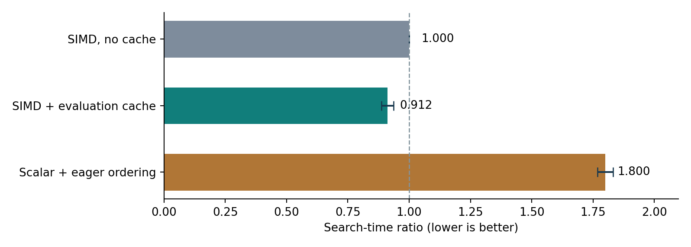
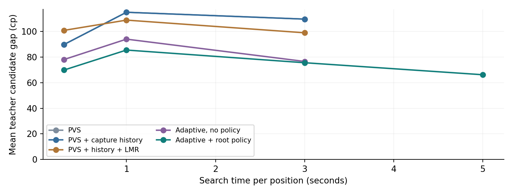
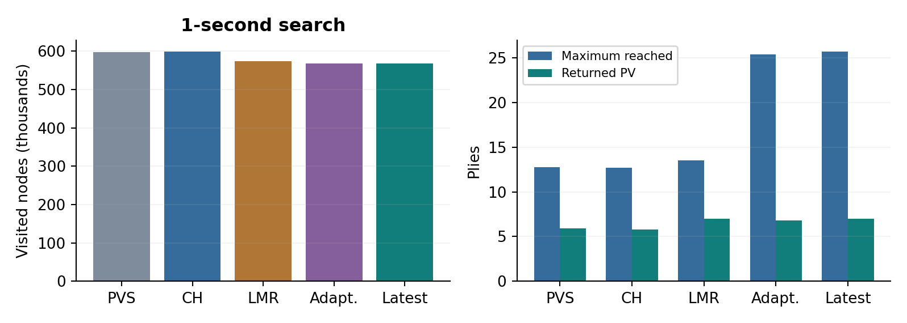
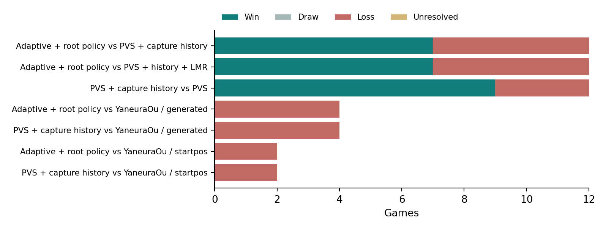

# 将棋AI研究 成果総括・追加検証

Shogi Search Lab / v0.1-v0.20

**報告日：2026年9月27日　対象：最新保存ソースと過去19報告書**

過去v0.1〜v0.20を整理し、不確かだった速度・探索配分・着手品質・対局成績を追加検証した。48対局、660探索、深い教師による7局面の感度分析を実施。評価cacheは探索結果を保って8.84%高速化し、駒取り履歴は従来PVSに9勝3敗だった。最新構成は既存2方式に各7勝5敗で、棋力の優位は未確定。固定やねうら王には最新・対照とも6敗ずつで、対抗できる水準には至っていない。

| 今回追加した検証 | 規模 |
| --- | --- |
| やねうら王との対戦 | 12局（生成開始8局＋平手初期から4局） |
| 既存探索・機能差の対戦 | 36局（3比較×6開始局面×先後交換） |
| 新規局面での固定時間比較 | 24局面・384探索、0.3/1/3秒＋最新5秒 |
| 同一10万ノードの速度比較 | 24局面×3方式×3反復＝216探索 |
| 既知の難しい終盤 | 6局面×5方式×1/3秒＝60探索 |
| 教師評価の感度分析 | 事後選択7局面を深さ12→16で再採点 |

**読み方。** 過去の成果は当時の実験条件での結果として記載し、今回の追試と分けた。既存手法は同じC++基盤でのPVS・LMR等の実装で比較した。対戦相手のやねうら王は固定版6.03 / WASM・2019年のKP256評価であり、最新の強豪構成ではない。

本書は「速くなった」「深く進んだ」「良い手を選んだ」「対局に勝った」を別の成果として評価する。結果を保つ高速化と、探索範囲を変える工夫を区別した。

<!-- PAGEBREAK -->

# 1　研究の目的と、作ったもの

限られた計算時間で有力な変化を多く読み、その根拠となる局面・読み筋を人が確認できる将棋AIを目指した。研究の中心は、評価・探索順序・枝刈り・計算費用の関係を観測し、仮説を実装と対照実験で確かめることにある。

合法手生成・盤面更新は固定版やねうら王のコードを再利用し、探索・評価互換処理・実験・観測部分をC++17で構築した。上位5候補を保持するsession機能と、各種探索方式を比較するadvanced機能がある。最新の対局実験は毎手advanced探索を作り直すため、sessionの保持木やponderの効果は含まない。

ナースロスタリングの構造解析との接点は、仮着手の影響、評価境界の変化、どの枝がどの根拠で省略されたかを記録する研究方法にある。将棋では相手の応手を自由に固定できないため、応手数の減少そのものを安全な枝刈りの根拠にはしない。

## 評価指標の定義

| 指標 | 今回の測り方・解釈 |
| --- | --- |
| 1. 対やねうら王 | 勝・敗・引分・未決着を分離。開始局面と先後をそろえる。 |
| 2. 既存手法との対戦 | 同じNNUE・計算基盤のPVS / PVS＋LMRと比較。機能を外す対照も用意。 |
| 3. 実行時間 | 探索本体elapsed_msと、起動・モデル読込等を含むwallMsを別記。 |
| 4. 読み深さ | PVSの完了深さ、最大到達手数、返したPVの長さを分離。1手＝1ply。 |
| 5. 探索ノード数 | 再訪問・静止探索を含む訪問数。異なる木では少ないほど良いとは限らない。 |
| 6. 補助指標 | NPS、教師候補差、100cp超の候補差、初回未完了、時間超過、PV合法性、静止探索比率。 |

教師候補差は「比較対象全方式・全時間の着手と教師の着手を集めた集合」での最高評価との差。全合法手の真の最善手損失ではない。教師と自作側は同じ基礎NNUEを用いるため、独立した棋力指標にはならない。

<!-- PAGEBREAK -->

# 2　研究の経緯：探索基盤からNNUEまで

| 版・主題 | 確認された結果 | 解釈・限界 |
| --- | --- | --- |
| v0.1 / 探索の基準 | 全幅Negamax、αβ、手順序を比較。深さ3・8局面でノード1,726,685→24,657（98.57%減）。 | 指定深さ・駒得評価の結果。棋力の改善率ではない。 |
| v0.2 / 反復深化 | 時間・ノード制限、完了反復の採用、前回PVの優先を実装。 | 中断した反復を読了扱いにしない基盤。 |
| v0.3 / 上位5手の保持 | 候補別の評価・深さ・部分木を保存し、着手後に根を移して継続。 | session機能。最新advanced対局の毎手保持とは別。 |
| v0.4 / 境界と伝搬 | 上位5位を閾値とする零窓探索。22条件×4方式×3回、上位5手・値が一致。ノード63.3%減、時間64.0%減。 | 応手数による試行・順序付けはノード17.5%増。既存原理の応用。 |
| v0.5 / 既存探索の比較 | 8ドライバ・24スイッチ。結果を保つ15設定で855比較一致。LMR等の見落としを観測。 | ノード11.2%減でも時間26.3%増の設定あり。管理費用が効く。 |
| v0.6 / やねうら王戦 | 駒得評価の自作は4局全敗。枝刈りで深く進んでも着手品質は改善しなかった。 | 探索と評価関数の両方を改善する必要を特定。 |
| v0.7 / 位置評価 | 38特徴を手動で追加。16局面・3秒の平均候補差127.81→93.75cp。 | 線形学習版は採用見送り。教師候補内の差。 |
| v0.8 / NNUE互換推論 | 既存KP256重みを使用。手動評価に4勝0敗、固定やねうら王に0勝2敗。差分・必要時評価で時間34.6%短縮。 | NNUE全体を独自学習した成果ではない。相手と同じ配布重み。 |
| v0.9 / 探索処理の軽量化 | 戦術手の直接生成、整数順序キー、手生成の遅延。固定深さ時間19.6%短縮。旧版に4勝0敗。 | 少数対局。12局面の候補差改善は1局面に集中。 |

**この段階の主成果。** まず同じ答えをより少ない計算で得る基盤を整え、次に評価関数の情報量を増やした。特にNNUE導入時は、平均完了深さが増えていなくても教師候補差が改善した。深さだけでは性能を評価できない実例である。

<!-- PAGEBREAK -->

# 3　研究の経緯：学習と選択的探索

| 版・主題 | 確認された結果 | 解釈・限界 |
| --- | --- | --- |
| v0.10 / 評価ヘッドの学習 | 192進行・56,805局面。静的MAE726.96→709.13cp。元評価に25勝7敗。 | 後続の単純補正対照・別局面の追試まで含めて判断する。 |
| v0.11 / 学習と停止処理の切分け | 128対局。学習版は+40cp対照に14勝18敗、4倍ノードでは7勝8敗・未決着1。緊急着手の候補差1,340→232.85cp。 | 学習固有の優位は未確認。初回未完了時の着手処理の重要性を確認。 |
| v0.12 / 候補差の学習 | 候補ペア学習、探索葉の分布観測。64対局。倍率補正対照には両予算とも6勝10敗。 | 予測誤差の低下だけでは棋力向上しない。葉の補正偏りを検出。 |
| v0.13 / 学習型枝刈り | 最終版のノード比0.9983、時間比1.0227。182省略中1件のα更新見落とし。基準に7勝9敗。 | 学習型枝刈りは標準off。厳密な安全性を主張しない。 |
| v0.14 / 駒取り履歴・方策 | 8開始局面の先後交換で駒取り履歴13勝3敗、方策併用10勝6敗、LMR併用11勝5敗。 | 新しい固定時間対局で駒取り履歴を再確認する必要。 |
| v0.15 / SIMD・遅延順序付け | 16根×3回、同じ深さ・ノード・値・PVで時間49.9%短縮。 | 対局なし。既存LMRと履歴LMRは深さと品質の優劣が一致しない。 |
| v0.16 / 費用による選択的探索 | 時間とノードで制御。最大到達手数は1秒で13.06→22.94。16対局は全敗。 | 反復番号は深さではない。既知終盤で初回比較が終わらない反例。 |
| v0.17 / 根の学習方策 | コード・all-policyモデルを保存。後続版で比較可能。 | 独立した報告書・実験原データがなく、当時の効果は未確認。 |
| v0.18 / 長時間・静止探索再利用 | 12局面の基準候補差は1秒171.42、3秒32.33、5秒32.33、10秒3.92cp。8対局全敗。 | qcacheは3/5秒で悪化。時間延長の利益は局面依存。 |
| v0.19 / 保存条件・統計軽量化 | 同ノードで時間4.0%短縮。入口保存と旧版の着手品質は新12局面・全36組同等。8対局全敗。 | 入口保存は実験機能。難しい終盤の初回比較未完了が残る。 |
| v0.20 / キャッシュ・補正・SEE | 静的評価cacheは旧版比4.53%短縮。補正は新24局面で悪化。SPSAは改善信号なし。4対局全敗。 | SEEはα更新見落としを検出。採用候補は同値な静的評価cache。 |

v0.17だけは当時の独立した報告と原データを確認できなかった。後続版の保存結果と今回の方策有無の対照から、現在の挙動を評価する。過去の各版を新しい順に強いとみなさない。

<!-- PAGEBREAK -->

# 4　追加実験の条件

ソースはGitHubのwork/v0.20-recent-research、コミット4f94f7baf775c4c3870e5d9863536305b4902deb。探索ロジック・モデル・パラメータを変更せず、実験用スクリプトと集計・監査を追加した。開始前に方式、乱数種、予算、ハッシュを固定し、結果を見て方式を選び直していない。

| 略称 | 方式 | 比較の目的 |
| --- | --- | --- |
| 従来PVS | PVS＋TT＋history/killer/counter＋静止探索 | 既存探索の基準 |
| PVS＋駒取り履歴 | 従来PVSにcapture historyを追加 | v0.14の機能効果を再確認 |
| PVS＋履歴＋LMR | 駒取り履歴版に既存LMRを追加 | 既存の選択的な深さ削減と比較 |
| 選択的・方策なし | 費用ベースのadaptive探索 | 探索配分そのものを比較 |
| 最新構成 v0.20 | adaptive＋学習済み根方策＋静的評価cache | 現在の保存構成を評価 |

5方式は同じ固定NNUEと静的評価cacheを使用し、評価の計算速度差をそろえた。adaptiveの静止探索は固定6手で切らず継続する。通常探索方式の上限は16手、adaptiveは費用反復と95手の非常停止。通常方式が上限で停止した件数もログに残した。

**局面。** 新seed270901〜270908の8進行から28/44/60手後を採り、24局面を生成。教師の深さ6・上位3候補中100cp以内から序盤を変化させた。保存済み根JSONとの完全一致を除外したが、配布NNUEの学習局面や全探索子孫との非重複は保証できない。未知戦型を網羅する試験ではない。

**対局。** 生成進行の20手後から先後交換。内部比較は各手200ms、対やねうら王は双方1,000ms。定跡・ponderなし、1スレッド、毎手fresh/reset。追加200手で終わらなければ未決着。評価値で勝敗を早期判定しない。時間超過を即負けにはせず、実際の時間を計測する。

**開始局面の補足。** 対やねうら王用の生成局面は教師深さ6で先手+217/+2,092cp。後者は大差のある開始条件だったため、相手との対局結果を見る前に平手初期からの先後交換4局を追加した。元の8局は保持し、初期局面の4局と分けて集計する。

自作はネイティブC++、相手はWASM。同じ1秒での実システム比較であり、NPSの差を探索アルゴリズムだけの差とは解釈しない。

**集計。** 探索は直列実行し設定順を回転。速度は3回の局面別中央値の合計比。区間は8進行を単位に10,000回再標本化した参考95%区間。24局面を24独立標本とは数えない。対局も開始局面の先後ペアを保つ。共有CPU環境・少数進行の結果であり、一般的なEloには換算しない。

<!-- PAGEBREAK -->

# 5　実行時間：同じ読みを速く処理できたか

図1　同一10万ノードの探索時間比。破線はSIMD・cacheなし。横線は8進行単位の参考95%区間。

| 計算法 | 中央値合計 ms | 時間比 [参考95%区間] |
| --- | --- | --- |
| 評価cacheなし | 3,879.88 | 1.000 [1.000, 1.000] |
| 最新構成 v0.20 | 3,536.71 | 0.912 [0.887, 0.936] |
| scalar＋全件整列 | 6,981.88 | 1.800 [1.768, 1.832] |

評価cacheは同じ探索量・同じ結果で8.84%短縮した。時間比の参考区間は0.887〜0.936、24根中23根で速かった。起動・モデル読込等を含む応答時間でも6.32%短縮。SIMD＋遅延順序付けを外した対照は、cacheなしSIMD版の1.800倍の探索時間を要した。

216探索すべてで、比較する3方式のscore・PV・nodes・完了反復・停止理由・未完了時PVが対応して一致した。今回のscalar対照は最新コードからSIMDと遅延順序付けを外したもので、旧v0.14バイナリの厳密な復元比較ではない。

過去の34.6%、19.6%、49.9%、4.0%、4.53%は異なる局面・条件・基準の測定である。掛け合わせて「累積で何倍」とは主張しない。また、同じ持ち時間でノード数が増えることと、勝率が増えることを区別する。

<!-- PAGEBREAK -->

# 6　着手品質と、長く考える効果

| 方式 | 0.3秒 cp | 1秒 cp | 3秒 cp | 5秒 cp |
| --- | --- | --- | --- | --- |
| 従来PVS | 89.87 | 115.04 | 109.70 | - |
| PVS＋駒取り履歴 | 89.87 | 115.04 | 109.70 | - |
| PVS＋履歴＋LMR | 100.91 | 108.91 | 99.00 | - |
| 選択的・方策なし | 78.13 | 94.04 | 76.61 | - |
| 最新構成 v0.20 | 69.91 | 85.52 | 75.61 | 66.22 |

図2　共通候補集合に対する教師評価差。小さいほど良い。固定やねうら王の深さ12による近似評価。

3秒の最新構成はPVS＋駒取り履歴に比べ候補差が平均34.09cp小さく、23根では5改善・15同等・3悪化。8進行単位の参考区間は-72.70〜-6.54cp。LMR版との差は-23.39cp（3改善・19同等・1悪化）。学習根方策を外したadaptiveとの差は-1.00cpにとどまった。複数比較を含む探索的結果であり、一般的な棋力差の証明ではない。

深さ12教師では、最新の1秒→5秒は2改善・19同等・2悪化。平均候補差は85.52→66.22cpだが、0.3秒→1秒では平均が悪化した。深さ16で悪化判定が逆転する例もあり（付録B）、真の着手悪化とは断定しない。23根の教師候補最高値の絶対値は中央値3,511cp、12根が2,000cp超。事後の補助集計では絶対値500cp以内の6根で、3秒の候補差は駒取り履歴268.17→最新164.50cpだった。

通常cpで比較できる根数は各方式・予算とも23 / 24。詰み・特殊値（絶対値30,000以上）を含む候補集合はcp平均から除外し、元データは保持する。自作の生評価値（歩90）とは混ぜない。各条件は1回の時間制限探索であり、着手の時間変動も含む。

<!-- PAGEBREAK -->

# 7　深さ・探索量・応答時間

| 予算・方式 | 探索 ms | ノード/探索 | 通常深さ | 最大到達 | PV手数 |
| --- | --- | --- | --- | --- | --- |
| 1秒 従来PVS | 1,000.4 | 597,663 | 4.71 | 12.75 | 5.92 |
| 1秒 PVS＋駒取り履歴 | 1,000.3 | 598,380 | 4.67 | 12.67 | 5.79 |
| 1秒 PVS＋履歴＋LMR | 1,000.7 | 573,903 | 5.38 | 13.54 | 7.00 |
| 1秒 選択的・方策なし | 1,000.3 | 567,809 | - | 25.38 | 6.79 |
| 1秒 最新構成 v0.20 | 1,000.1 | 568,235 | - | 25.67 | 7.00 |
| 3秒 従来PVS | 3,000.1 | 1,682,770 | 5.12 | 13.29 | 6.38 |
| 3秒 PVS＋駒取り履歴 | 3,000.2 | 1,671,847 | 5.12 | 13.29 | 6.38 |
| 3秒 PVS＋履歴＋LMR | 3,001.1 | 1,642,388 | 5.92 | 14.25 | 7.12 |
| 3秒 選択的・方策なし | 3,000.3 | 1,626,056 | - | 30.04 | 7.12 |
| 3秒 最新構成 v0.20 | 3,000.1 | 1,671,952 | - | 28.62 | 7.46 |

図3　1秒探索の訪問ノードと、最大到達手数・返したPV。これらは同じ意味の「深さ」ではない。

最新構成は1秒で最大到達25.67手、返したPVは平均7.00手。PVS＋駒取り履歴の12.67手・5.79手より深い変化に進む一方、訪問ノードは約56.8万で、同方式の約59.8万より少ない。自作側の1秒NPSは約56.8万。静止探索はノードの約96.0%を占めるが、これは処理時間の割合ではない。

adaptiveの通常深さ欄は対象外。「最大到達」は最深の一本であり、全候補をその深さまで確認した保証ではない。ノード数には静止探索と再訪問を含む。NPS・起動込み時間・停止理由の全値はquality-summary.csvに保存した。

<!-- PAGEBREAK -->

# 8　対局：既存手法と、やねうら王

| 左側から見た比較 | 勝 | 敗 | 引分 | 未決着 | 開始局面 |
| --- | --- | --- | --- | --- | --- |
| 最新構成 v0.20 対 PVS＋駒取り履歴 | 7 | 5 | 0 | 0 | 6 |
| 最新構成 v0.20 対 PVS＋履歴＋LMR | 7 | 5 | 0 | 0 | 6 |
| PVS＋駒取り履歴 対 従来PVS | 9 | 3 | 0 | 0 | 6 |
| 最新構成 v0.20 対 やねうら王（生成） | 0 | 4 | 0 | 0 | 2 |
| PVS＋駒取り履歴 対 やねうら王（生成） | 0 | 4 | 0 | 0 | 2 |
| 最新構成 v0.20 対 やねうら王（初期） | 0 | 2 | 0 | 0 | 1 |
| PVS＋駒取り履歴 対 やねうら王（初期） | 0 | 2 | 0 | 0 | 1 |

図4　全48対局の内訳。自作同士は200ms/手、対やねうら王は双方1秒/手。

内部比較36局では、駒取り履歴版が従来PVSに9勝3敗。先後ペア単位の参考区間は得点率58.3〜91.7%で、過去の13勝3敗とは別の200ms条件でも効果を支持した。最新構成は駒取り履歴版・LMR版に各7勝5敗。参考区間はいずれも33.3〜83.3%で、優位は未確定。対やねうら王は双方1秒で、最新・駒取り履歴とも生成開始で0勝4敗、平手初期から0勝2敗。全12局を詰みまで確認した。

対局数は独立標本数ではない。内部比較は6開始局面、対やねうら王は生成2局面と平手初期局面のみ。手数が伸びたことは抵抗の長さを示す補助観測だが、それだけでは棋力差の証拠にならない。詳細な棋譜・各手のPV・ノード・時間・終了理由を保存した。保存進捗の不整合により内部比較3局を記録済みの全履歴から再開した。既存KIFのあった2局は再開後も棋譜が完全一致し、記録を保持している。

<!-- PAGEBREAK -->

# 9　難しい終盤と、失敗例

| 方式 | 既知終盤1秒：初回完了 | 既知終盤3秒：初回完了 | 新24局面1秒：初回完了 |
| --- | --- | --- | --- |
| 従来PVS | 6/6 | 6/6 | 24/24 |
| PVS＋駒取り履歴 | 6/6 | 6/6 | 24/24 |
| PVS＋履歴＋LMR | 6/6 | 6/6 | 24/24 |
| 選択的・方策なし | 2/6 | 6/6 | 24/24 |
| 最新構成 v0.20 | 2/6 | 5/6 | 24/24 |

1秒では通常PVS系3方式が全6根の初回比較を完了し、選択的探索は方策の有無とも2/6だった。3秒では方策なし6/6、最新5/6。最新構成では根以外のほぼ全ノードが静止探索となり、初回候補比較に必要な仕事量が予算を圧迫した。

今回の48対局における自作側の初回未完了は、全4206着手中0件だった。既知難局面の失敗率とは分けて解釈する。

## 時間内に答えを返す品質

探索を中断して最後の完了反復を返せることと、最初の候補比較さえ終わらないことを区別した。未完了時は、読み終えた根候補または緊急の合法手を返す。そのPVを「十分に読んだ結果」とは表示しない。

| 方式・1秒 | 探索p95 ms | 起動込みp95 ms | 5%＋5ms超過/24 |
| --- | --- | --- | --- |
| 従来PVS | 1,000.20 | 1,100.61 | 0 |
| PVS＋駒取り履歴 | 1,000.15 | 1,100.34 | 0 |
| PVS＋履歴＋LMR | 1,001.40 | 1,085.64 | 0 |
| 選択的・方策なし | 1,000.32 | 1,080.24 | 0 |
| 最新構成 v0.20 | 1,000.24 | 1,088.59 | 0 |

深さ16で再採点した7根では、大きな改善3例の優劣は維持されたが、0-44の改善幅は300→38cpに縮小した。最大悪化例7-28は-68→0cp、時間延長の悪化例3-28は-66→+367cp、4-28は-208→+106cpへ変わった。浅い教師の値だけで「長く考えるほど悪い」と判断できない。全差分と事後選択の条件を付録Bに示す。

既知終盤6局面は、過去1対局から抽出した診断集合である。通常対局での発生頻度の推定には使わない。全探索PVと全棋譜は別のルール実装tsshogiで合法性・終端・KIF読戻しを検査した。既存の自己検査7,128項目も通過した。

<!-- PAGEBREAK -->

# 10　成果の評価を更新する

## 成果として残ること

探索結果を保つ高速化、評価関数の互換実装、失敗を追跡できる実験基盤は、局所的な対局結果とは分けて積み上げられる。特に静止探索の費用、初回比較の未完了、学習による探索葉の分布変化を実際のログで観測できるようになった。

## 改善を断定しないこと

| 当初の観測 | 追試・対照で分かったこと | 現時点の判断 |
| --- | --- | --- |
| 評価学習が25勝7敗 | v0.11では+40cp対照に14勝18敗。4倍ノードでは7勝8敗・未決着1。 | 学習固有の優位は未確認。 |
| 候補差の予測誤差が減少 | v0.12の倍率補正対照には12k/48kとも6勝10敗。 | 静的誤差と棋力の改善は別。 |
| 学習型枝刈りで省略できる | v0.13の新規監査でα更新の見落とし。時間比1.0227。 | 標準採用しない。 |
| 読みを保存すれば有利 | v0.18のqcacheは3/5秒で悪化、v0.19入口保存は新規局面で同等。 | 保存・照合の費用を含めて判断。 |
| 新しい補正で開発成績向上 | v0.20のcorrectionは新24局面で悪化。SEEも局所見落とし。 | 開発集合の最良値を成果としない。 |

維持する改善は、同値性と速度を確認したNNUE推論・評価cache、および対局で再度効果を支持した駒取り履歴。最新の選択的探索は研究用として継続するが、PVS/LMRに対して確実に強いという判断は留保する。学習枝刈り・correction・qcacheは、過去の不採用理由を覆す証拠がないため実験設定として扱う。

研究上の貢献は、既存手法を組み合わせた際の有効条件・失敗条件を、速度・候補品質・勝敗の対照とログで示した点にある。新しい枝刈り理論の証明、既存強豪を超える棋力、NNUE全体の独自学習を達成したとは位置付けない。

<!-- PAGEBREAK -->

# 11　次の研究課題と再現方法

**優先1：初回候補比較への計算配分。** 難所で静止探索の一本が予算を使い切る原因を、根候補別ノード・中断位置・反論発見時刻で追う。固定上位k手の切捨てより、候補の未確認範囲と再探索の費用を明示する設計を優先する。

**優先2：方策を置く場所と学習対象。** 根の手順序だけでなく、浅い評価が同点にする候補、深い教師との不一致、最初の反論を発見するまでのノード数を教師信号の候補にする。今回の24局面は以後開発用とし、採用判断には別の進行を使う。

**優先3：棋力試験の独立性。** 開始局面の数と戦型を増やし、200msと秒単位を別試験にする。最新のネイティブ版やねうら王・別の評価関数・別系統エンジンで、同一NNUE教師に依存しない評価を行う。これは今後の課題で、今回実施済みではない。

## 再現・保存物

ソース・スクリプト・生JSON・教師応答・CSV・KIF・プロトコル・ハッシュは、work/research-summary-20260927ブランチのengines/shogi-search-labに保存。実験ごとのファイルはresults/retrospective-20260927以下。過去の報告とデータは上書きしていない。

実行順はビルド・自己検査 → 条件固定 → 一次実験 → 平手初期からの補助対局 → 深さ16診断 → 集計・独立監査。追試ではV21_RESULTSに新しい出力先を指定する。評価資材は既存fetch_opponent.pyで取得・照合する。詳しい手順はREPRODUCE-retrospective-20260927.mdを参照。

## 根拠資料

本書の過去数値はREPORT.md、REPORT-v0.2.md〜v0.20.md（v0.17欠落）および対応するsummary.jsonに基づく。historical-inventory.jsonに存在確認とSHA-256を記録した。過去の時間短縮率は別条件のため合算しない。

1. Tsuruoka, Yokoyama & Chikayama (2002), Game-Tree Search Algorithm Based on Realization Probability. https://www.nactem.ac.uk/tsuruoka/papers/icga02.pdf
2. Stockfish公式 NNUE技術資料（整数推論・差分計算・SIMD）。https://official-stockfish.github.io/docs/nnue-pytorch-wiki/docs/nnue.html
3. 対戦相手の固定ソース：arashigaoka/YaneuraOu.wasm, b2defb6d255ea44b3fead30e13f28b96e0ab0cc7。THIRD_PARTY.mdと資材ハッシュも参照。

選択的探索は実現確率探索の考え方を参照するが、本実装の費用は履歴・手の性質に基づく規則であり、棋譜から校正した確率ではない。NNUEのSIMD化も既存原理の実装であり、その独自発明を主張しない。

<!-- PAGEBREAK -->

# 付録　過去の主要な速度・対局比較

## 条件をそろえた当時の速度測定

| 版・変更 | ノード | 速度・時間 | 元の条件 |
| --- | --- | --- | --- |
| v0.1 全幅→順序付きαβ | 98.57%減 | 約49.2倍 | 駒得評価・深さ3・8局面 |
| v0.4 上位5手の零窓選別 | 63.3%減 | 64.0%短縮 | 22条件・各3回。保持機能の比較 |
| v0.8 NNUE差分・必要時評価 | 同一 | 34.6%短縮 | 同じNNUE評価の計算法を比較 |
| v0.9 探索処理の軽量化 | 同一 | 19.6%短縮 | 固定深さ3・8局面・各5回 |
| v0.15 SIMD・遅延順序付け | 同一 | 49.9%短縮 | 固定深さ4・16局面・各3回 |
| v0.19 統計処理軽量化 | 同一 | 4.0%短縮 | 20万ノード・8局面・各3回 |
| v0.20 静的評価cache | 同一 | 4.53%短縮 | 15万ノード・8局面・各3回、旧版比 |

各行で評価関数・深さ・局面・比較基準が異なるため、行をまたいで短縮率を合算・乗算しない。固定ノード・固定深さ・固定時間を区別して元の報告へ遡れるようにした。

## 固定やねうら王との過去の対局

| 版・自作側 | 局数 | 成績 | 条件 |
| --- | --- | --- | --- |
| v0.6 駒得評価ほか | 4 | 0勝4敗 | 当時の設定差を含む |
| v0.8 NNUE | 2 | 0勝2敗 | 双方3秒、1開始局面の先後交換 |
| v0.16 基準・adaptive・補正2種 | 16 | 0勝16敗 | 双方1秒、2開始局面×4方式×先後 |
| v0.18 基準・qcache | 8 | 0勝8敗 | 自作3/5秒、相手2秒、平手開始 |
| v0.19 旧版・入口保存 | 8 | 0勝8敗 | 自作3/5秒、相手2秒、平手開始 |
| v0.20 基準・補正+cache | 4 | 0勝4敗 | 双方1秒、平手開始 |

これらの対戦相手も歴史的な固定版であり、最新ネイティブ版ではない。時代順の手数や勝率を、同一条件の棋力変化として扱わない。今回の追加対局は第8節に開始条件ごとに掲載した。

<!-- PAGEBREAK -->

# 付録B　より深い教師による感度分析

| 局面ID | 比較（左の着手 - 右の着手） | 深さ12 | 深さ16 |
| --- | --- | --- | --- |
| 0-44 | 最新3秒 - 駒取り履歴3秒 | +300cp | +38cp |
| 7-44 | 最新3秒 - 駒取り履歴3秒 | +231cp | +310cp |
| 4-44 | 最新3秒 - 駒取り履歴3秒 | +224cp | +313cp |
| 7-28 | 最新3秒 - 駒取り履歴3秒 | -68cp | +0cp |
| 3-60 | 最新5秒 - 最新3秒 | +282cp | +214cp |
| 3-28 | 最新5秒 - 最新3秒 | -66cp | +367cp |
| 4-28 | 最新1秒 - 最新0.3秒 | -208cp | +106cp |

正のcp差は左側の着手の評価が高いことを表す。各行で同じ候補集合を使い、教師の探索深さだけを12から16に増やした。詰み評価になった場合はcpに置換せず、値の種類と両候補を記載する。局面IDの後半は初期局面からの手数で、根の棋譜はroots.jsonに保存した。

深さ16で再採点した7根では、大きな改善3例の優劣は維持されたが、0-44の改善幅は300→38cpに縮小した。最大悪化例7-28は-68→0cp、時間延長の悪化例3-28は-66→+367cp、4-28は-208→+106cpへ変わった。浅い教師の値だけで「長く考えるほど悪い」と判断できない。全差分と事後選択の条件を付録Bに示す。

**事後診断の限界。** 対象は3秒の大きな改善3根・最大悪化1根と、探索時間を変えると評価が変わった3根を、最初の結果を見た後で選んだ。独立した追試集合ではなく、全24根の平均や対局勝率の再推定には使わない。深さ16も厳密な正解ではない。

**cp平均から除外した局面。** 4-60では教師がG*6aを詰み負け14手、7i7hを詰み負け6手と評価した。詰み距離を通常cpと混ぜず、元の候補と着手を保存した。除外基準は候補集合全体に適用し、方式ごとに異なる根を使わない。

**監査。** 48局の全着手・棋譜読戻し、660探索の返却PV、深さ12の24根と深さ16の7根の教師PVを独立に再生した。検査対象数とSHA-256はaudit.json / manifest.jsonに記録した。
