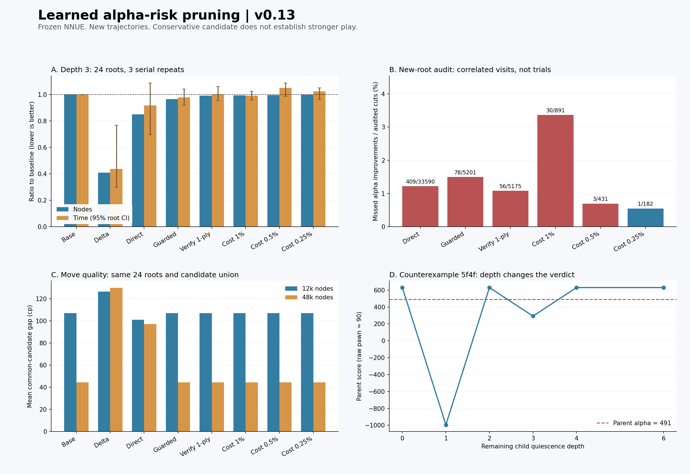

# 学習型枝刈りの設計・実装・実験・改善（v0.13）

実行日：2026-09-21（UTC）。αβ探索の文献を踏まえ、静止探索で「この取りが現在のαを更新するか」と「読むのに何ノードかかるか」を学習する2モデルを実装しました。予測のみ、危険な手の保護、浅い確認、コスト学習、厳しい閾値の順に改善し、固定後の新規24局面・384着手比較・576固定深さ探索・96監査探索・32対局まで完了しました。

最終の保守的な版は、固定深さのノード比 **0.9983**、探索時間比 **1.0227**（基準=1）。同一ノード条件では24局面すべてで基準と同じ着手でした。しかし、新規監査では **182省略中1件**のα更新見落としがありました。強くなったとは確認できず、標準の枝刈りは `off` のままです。

## 文献を実装へどう使ったか

[ProbCutのチェス適用研究（Jiang & Buro, 2003）](https://skatgame.net/mburo/ps/chessmpc.pdf)から、統計的な省略条件を校正し、探索短縮と対局性能を別に測る考え方を採用しました。[ERPS（Winands & Björnsson, 2007）](https://dke.maastrichtuniversity.nl/m.winands/documents/ERPS.pdf)の初期候補保護・再探索、[TreeStrap（Venessほか, 2009）](https://davidstarsilver.wordpress.com/wp-content/uploads/2025/04/bootstrapping-from-game-tree-search.pdf)の探索内部の教師と境界値の区別も参照しています。SCOUTとVerified Null-Moveを含めた5本の対応と相違は `RESEARCH-v0.13.md` にまとめました。各論文の手法をそのまま再実装したものでも、文献にある棋力向上をこちらで再現したと主張するものでもありません。

学習教師は、幅1の窓で**完了した**子探索に対する `y = 1[-child_score > alpha]`。途中停止した子は除外し、fail-soft値を正確な評価値として回帰しません。NNUEは元の固定モデルを使い、今回の追加学習で評価関数を変更していません。

## 学習と分割

| 用途 | 実使用対局数 | 根数 | 完了ラベル数 |
|---|---:|---:|---:|
| 学習 | 63 | 126 | 859,143 |
| 閾値校正 | 16 | 32 | 220,581 |
| 開発・改善比較 | 16 | 32 | 221,594 |

計1,301,318ラベル。記録された親局面は560,133種類で、学習・校正・開発間の一致・左右反転一致は0件。95件の途中停止した子ラベルを除外しました。同じ対局・探索枝の訪問には相関があるため、百万件の独立試験と解釈しません。

17特徴のリスク分類の校正Brier scoreは **0.052764**、学習平均だけを返す対照は **0.179912**。教師ラベルは実装した基準探索に対するもので、将棋の真の最善値ではありません。予測確率をそのまま未知局面の安全保証には使えません。

最終評価は別seedの24新規進行から、教師深さ6で絶対値250cp以下の非王手局面を1つずつ選択しました。採用値の範囲は−225〜223cp。過去v0.10〜v0.12の対象局面と今回の全教師ログ親局面に対し、一致・左右反転一致を除外しました。戦型の開始手順は過去実験と共有しており、未知戦型への汎化試験ではありません。探索子孫の全てが未知という意味でもありません。

## 開発で何が失敗し、何を改善したか

| 方式 | 深さ3ノード比 | 局所的見落とし / 監査省略数 | 根の着手変更 / 32 |
|---|---:|---:|---:|
| direct | 0.7813 | 881/121,272 | 2 |
| guarded | 1.0925 | 226/22,303 | 1 |
| verified | 1.1250 | 206/22,049 | 1 |
| efficient | 0.9708 | 44/5,543 | 1 |
| efficient005 | 0.9818 | 18/4,101 | 1 |
| efficient0025 | 0.9935 | 0/2,720 | 0 |

表のノード比は監査の追加ノードだけを差し引いた探索仕事量で、実時間ではありません。全32根が完了しています。

`direct` は王手・成り等の基礎保護の後、予測リスク5%以下で省略。約22%のノード減と引き換えに見落としが出ました。`guarded` では先頭2手、取り返し、玉の取り、敵玉近傍、残り深さ2以下、特徴範囲外を追加保護し、1局面で最大1手しか学習省略しません。しかし、誤った省略で探索順や再探索が変わり、ノード数が増える例もありました。

初期の深さ0確認 `staticcheck` は開発で見落とし0件、根着手・値も全一致でしたが、ノード比1.0025。元から1ノードで終わるstand-patカットを再確認しており、実質的な節約になりません。現行 `verified` は子を深さ1・親αより90raw低い閾値で確認しますが、取り返しが探索範囲の外へ押し出され、見落としと追加コストが残りました。

そこで「子探索が4ノード以上か」を学習し、コスト確率2%以上の枝に省略を絞る `efficient` を追加。校正閾値1%に加え、開発だけで0.5%、0.25%を比較しました。最終対局候補は、開発で見落とし0、根の着手・値が全一致だった0.25%版です。ノード削減は開発でも約0.65%に留まり、実時間や棋力の改善は仮定していません。モデル・閾値・実行バイナリは新規評価の前にハッシュで固定しました。

## 新規24根の固定深さ・実時間

深さ3、上限200万ノード、各方式3回、方式順序を回転。全処理終了後に直列で測定し、各根の3回の中央値を合計しました。探索内部の時間で、プロセス起動と評価モデルの読込みは含めません。数値が小さいほど少ない仕事・短い時間です。

| 方式 | ノード比 | 時間比 [95%参考区間] | 着手変更 / 24 | スコア変更 / 24 |
|---|---:|---:|---:|---:|
| base | 1.0000 | 1.0000 [1.000, 1.000] | 0 | 0 |
| delta | 0.4095 | 0.4372 [0.297, 0.767] | 5 | 12 |
| direct | 0.8490 | 0.9174 [0.696, 1.086] | 1 | 4 |
| guarded | 0.9658 | 0.9778 [0.919, 1.041] | 0 | 0 |
| verified | 0.9917 | 1.0009 [0.955, 1.061] | 0 | 0 |
| efficient | 0.9940 | 0.9922 [0.959, 1.023] | 0 | 0 |
| efficient005 | 0.9960 | 1.0496 [0.986, 1.087] | 0 | 0 |
| efficient0025 | 0.9983 | 1.0227 [0.963, 1.049] | 0 | 0 |

参考区間は進行を単位とする対応付きbootstrap 5,000回。測定環境・局面集合に依存し、実エンジンや長時間設定への同率の高速化を保証しません。全576探索が深さ3を完了し、3反復の探索値・PV・ノード数も一致しました。

## 同一探索量での着手品質

教師は固定YaneuraOu 6.03、深さ10。各根で全方式・両予算の着手と教師の着手をまとめて候補制限MultiPVで評価し、同じ候補集合の最上位との差を測りました。小さいほど良く、全24根がcpで比較可能でした。

| 方式 | 12,000ノード 平均差cp | 48,000ノード 平均差cp | 基準との着手相違 12k / 48k |
|---|---:|---:|---:|
| base | 107.00 | 44.46 | 0 / 0 |
| delta | 126.38 | 129.71 | 5 / 8 |
| direct | 101.08 | 97.12 | 1 / 1 |
| guarded | 107.00 | 44.46 | 0 / 0 |
| verified | 107.00 | 44.46 | 0 / 0 |
| efficient | 107.00 | 44.46 | 0 / 0 |
| efficient005 | 107.00 | 44.46 | 0 / 0 |
| efficient0025 | 107.00 | 44.46 | 0 / 0 |

保守的な版に着手改善はありませんでした。積極的な `direct` は小予算では平均差が少し下がりましたが、48,000ノードでは悪化しました。対照の固定delta枝刈りも、この集合では基準より平均差が大きくなっています。教師の限定深さの評価は絶対的な正解ではありません。

## 新規局面で省略を監査

最初の16根、深さ3。実際に省略する直前に、その枝を元の深さで読み直してα更新を確認します。監査しても省略自体は適用し、結果で救済しません。監査付きと通常実行の根結果が一致し、ノード差が監査ノード数そのものになることを確認しました。

| 方式 | 監査した省略 | α更新の見落とし | 比率 |
|---|---:|---:|---:|
| direct | 33,590 | 409 | 1.22% |
| guarded | 5,201 | 78 | 1.50% |
| verified | 5,175 | 56 | 1.08% |
| efficient | 891 | 30 | 3.37% |
| efficient005 | 431 | 3 | 0.70% |
| efficient0025 | 182 | 1 | 0.55% |

比率は相関のある訪問の記述統計です。別方式は到達する木も省略回数も異なります。見落とし数だけ、または比率だけで優劣を決めません。局所的なα更新見落としが、そのまま根の誤着手になるわけでもありません。

保守版の失敗は、根13の静止探索中の `5f4f`（飛車による歩取り）。親α=491raw、静的評価−176raw、予測リスク0.152%に対して、元の深さでの親評価境界は630rawでした。子の確認深さ0・1・2で、全窓評価はそれぞれ630・−994・630raw。深さ1では `3c8h+` を過大評価し、次の反撃 `4f4c` まで読むと結論が変わります。これは「少し読めば確認できる」という設計の限界を示します。局面・特徴・手順を保存し、今回の固定モデルの再学習には使っていません。独立SFEN診断は祖先の反復履歴を省くので、その点も記録しています。

## 先後交換32対局

双方1手12,000ノード、同じ8開始局面を先後交換。詰み・合法手なし・反復のみで決着し、200手追加の上限到達は未決着として扱います。KIFと全着手の解析を保存しました。

| 組合せ（左側が候補） | 戦績 | 得点率 [8開始局面bootstrap参考区間] | 総着手数 |
|---|---|---:|---:|
| efficient0025-base | 7勝9敗・引分0・未決着0 | 0.438 [0.312, 0.500] | 1,701 |
| efficient0025-delta | 12勝4敗・引分0・未決着0 | 0.750 [0.562, 0.938] | 1,628 |

少数の同系統開始局面であり、Eloへ換算しません。学習した方式の一般的な棋力向上を確認する結果にはなっていません。異なる持ち時間・大規模対局での追試が必要です。

## 実装確認と保存物

- 既存テスト6,544件が通過（通常115、セッション1,274、拡張探索5,155）。
- v0.12参照バイナリと19探索でスコア・PV・ノード数・完了深さ・停止理由・fallbackが一致。モデル閾値0との19探索も一致。
- 587行について独立SFEN解析で再構成できる15特徴を照合。候補数・直前手の着手先の2特徴はこの独立再構成の対象外。全窓の子探索19件で教師の閾値判定の符号を確認。
- 全384比較探索、576固定深さ探索、96監査探索と32対局の着手・PVを別実装の将棋ルールで確認。対局KIFの読戻しも一致。
- 最初の収集で欠損した5ログを取り直し、現在の1,301,318行を全件JSON解析した。明示flushと書込失敗の検出を追加。
- `src/advanced.cpp`・`advanced.hpp`・`main.cpp`：推論、保護、確認、監査、CLI。`models/v0.13/`：2モデルとモデルカード。
- `RESEARCH-v0.13.md`：一次文献と設計の対応。`REPRODUCE-v0.13.md`：ビルド・学習・再測定。`results/v0.13/`：生データ、学習履歴、失敗例、KIF、集計、図。

## 判断と次に改善すべき点

今回達成したのは、文献に基づく学習型枝刈りの実装、誤りの監査、段階的な保護・コスト学習の改善と、未使用進行での評価です。棋力改善の確認には至っていないため、既定値を切り替えません。

次の候補は、着手後の評価変化・利き・取り返しを表す特徴と、元から1ノードで終わる枝を避けてより重い通常探索の枝を対象にする設計です。ただし確認費用を含む実時間を目的にし、改善後はさらに別の進行で評価します。今回のテスト失敗例を次の学習に使うなら、それは次版の開発データへ移し、同じテストを独立評価として再利用しません。

