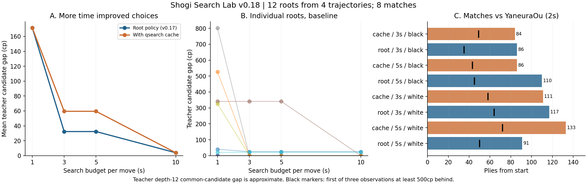

# v0.18：長時間探索の効果と、静止探索の再利用実験

**今回の12局面では、持ち時間を増やすことで選ぶ手の教師評価が改善した。一方、追加した読みの再利用は局面比較の3秒・5秒で基準を下回り、採用を見送る。対やねうら王は8局とも敗戦で、対局の強さが改善したとは確認できなかった。**

2026-09-22。GitHubの `work/v0.17-policy-budget`、コミット `b986fdb6d4362e79fc726de0511cf712f762b583` のコードと固定モデルを起点にした。同ブランチにはv0.17の報告書・実験原データが存在しなかったため、過去に報告された数値を再現済みとは扱わず、新しいv0.18の計測として記録する。

## 実装したもの

1. **qcache**：静止探索で読み終えた値・読み筋を再利用。正確値／上界／下界を区別し、同じ完全手順で到達した局面だけに使う。中断した節点は保存しない。
2. **qguard**：駒損と推定される駒取りを選別。王手回避・王手・成り・取り返し・玉の着手・両玉から2マス以内の駒取りを保護する。SEEによるヒューリスティックであり、見落としのない枝刈りではない。
3. 両機能の併用も比較。NNUEと学習済みの根方策の重みは変更していない。深さ・候補数を固定せず、費用による選択的探索を維持した。

開発8局面・500msでは、詰みスコアの1局面を除く7局面で4方式とも平均候補差5.43cp。事前の同点規則でqcacheを追試へ選んだ。ここでqcacheの優位が確認できたわけではない。

## 長く考えたときの着手品質

教師が指した別seedの4進行から各3局面、計12局面を採取し、各条件1回、計96探索。全方式・全予算の選択手と教師自身の手を共通集合にし、固定YaneuraOu 6.03の深さ12で採点した。候補差は集合内の最高評価との差で、小さいほど良い。全合法手の真の損失ではない。

| 自作の時間 | 学習済み根方策（基準） | ＋読みの再利用 |
|---|---:|---:|
| 1秒 | 171.42cp | 171.42cp |
| 3秒 | 32.33cp | 59.50cp |
| 5秒 | 32.33cp | 59.50cp |
| 10秒 | 3.92cp | 3.92cp |

基準方式の対応比較では、1→3秒で **4改善・8同等・0悪化**、3→5秒で全12同等、5→10秒で **1改善・11同等・0悪化** だった。1秒から10秒への改善は複数局面で起きたが、5秒から10秒の改善は根 `1-56` の341cp→0cpに集中した。長く考える利益は時間に比例せず、特定の戦術を読み切れる段階で現れた。

再利用版は根 `2-56` の3秒・5秒で `3f3e` を選び、基準の `P*2e` より教師評価が326cp低かった。他の11局面は同じ教師候補差であり、平均の悪化27.17cpはこの1局面による。10秒では再利用版も `P*2e` に到達した。

これは4つの相関した進行からの12局面であり、12独立対局ではない。過去の学習局面との全面的な非重複は保証していない。区間推定やEloによる一般化の主張は行わない。

## やねうら王との対局

全局、平手初期局面・定跡なし・戦型指定なし。自作3秒／5秒に対し、相手は2秒。先後を交換した。相手は2019年NNUE由来の固定6.03 WASM版であり、最新のネイティブやねうら王とは区別する。

| 方式 | 自作の時間 | 自作の先後 | 終局手数 | 結果 | 500cp不利の継続開始 |
|---|---:|---|---:|---|---:|
| 再利用 | 3秒 | 先手 | 84 | 負け | 49 |
| 基準 | 3秒 | 先手 | 86 | 負け | 35 |
| 再利用 | 5秒 | 先手 | 86 | 負け | 43 |
| 基準 | 5秒 | 先手 | 110 | 負け | 45 |
| 再利用 | 3秒 | 後手 | 111 | 負け | 58 |
| 基準 | 3秒 | 後手 | 117 | 負け | 64 |
| 再利用 | 5秒 | 後手 | 133 | 負け | 72 |
| 基準 | 5秒 | 後手 | 91 | 負け | 50 |

500cp欄は、相手の探索評価で500cp以上不利が3回連続して観測された、その最初の時点。確定した敗着ではない。手数が伸びた対局も抵抗力の観測として残し、不利になった後に長引いた場合と区別する。各方式・時間は2局だけなので、勝率や時間配分の優劣は断定しない。

再利用版の5秒・後手は133手で、基準の同条件91手より長く戦った。500cp不利の継続開始も50手→72手へ遅れており、この1局は抵抗力が改善した観測として評価できる。一方、先手5秒では110手→86手に短くなり、効果は混在した。各条件1局ずつのため、この好結果だけで方式を採用しない。

## 静止探索の問題は解決したか

既知の終盤6局面を1秒で再解析したところ、初回の全候補比較が完了したのは基準1/6、qcache 0/6、qguard 0/6、併用0/6。今回の追加で難所を解決できたとはいえない。新しい12局面の本比較では全96探索が少なくとも初回反復を完了した。

qcacheは開発8局面すべてで500msのうちに保存上限100,000件へ到達した。試験の3秒以降も全12局面で満杯。3秒の平均処理ノード数は基準約108万に対し再利用版約93万だった。ノードを省ける場面はあるが、記録・検索の負担と古い記録で領域が埋まる問題が残る。これらを原因候補としており、各費用の寄与を因果的に分離したプロファイルではない。

qguardの監査は既知3局面・合計3,330訪問でα改善の見落とし0件。ただし確認探索の合計も3,330ノードで、今回の監査対象はいずれも子の1ノードで終わった。深い犠牲手まで安全だったという証拠にはならない。監査対象は相関した訪問であり独立標本ではない。

## 正しさ・再現性

- セルフテスト：基礎115、継続探索1,274、拡張探索5,551、合計 **6,940チェック通過**。千日手、連続王手、詰み、中断からの盤面復元、小さいキャッシュ容量、読み筋の合法性を含む。
- 追加機能を無効にした8局面・2万ノードの旧版比較で、値・PV・ノード数・完了反復・停止理由・統計が一致。さらに8局面×3回・20万ノードの24対応比較でも一致。
- 同一ノードの24対応比較では、局面ごとの時間中央値の合計比（新ビルド無効／旧ビルド）は0.893。この環境では新ビルド全体の速度低下は観測しなかった。qcacheを有効にした効果とは別の測定。
- 独立ルール実装tsshogiで、8局・818着手、562探索出力、対局・自作探索のPV延べ6,317手、別途教師候補32本を検査。全KIFの読み戻しが一致。終局は両実装で確認。教師の生成進行256手も合法。
- CPU割当8コア相当。対局4組を別コアに固定し、同一先後・時間の基準と再利用版は同じコアで比較。局面測定は別コアで直列。環境再接続後、3対局は保存棋譜から再開し、未保存の比較ブロックを取り直した。毎手の探索状態は元からリセットされる。復元位置・時刻を記録した。

## 判断と次の改善

**qcache・qguardは任意の実験機能として残し、標準へ追加しない。** 今回は「時間を増やせば改善する局面がある」ことと、「再利用すれば必ず速く・強くなるわけではない」ことを分けて確認できた。

次は、すぐ終わる静止節点を保存対象から外し、再計算が高価な節点へ容量を配る方式を試す。その際、保存閾値・置換法を開発集合で決め、新しい対局で再評価する。併せて、3→10秒で改善した局面の読み筋を追い、どの反論・駒取りを最後まで読めたかを分析する。候補を学習で永久に除外する変更や、固定上位k手だけを読む変更は今回行っていない。

[観戦ファイル](v0.18-review.html)には8局の盤面と、その時点の読み筋を収録。ローカルで開く単体HTMLで、外部通信は不要。ブラウザー側のローカルファイル制限により実画面の操作確認は未実施。HTML内のJavaScript構文と収録データを確認した。[再現手順](REPRODUCE-v0.18.md)、[文献と設計](RESEARCH-v0.18.md)、`results/v0.18/` にプロトコル・生JSON・CSV・KIF・監査・失敗ログを保存した。
