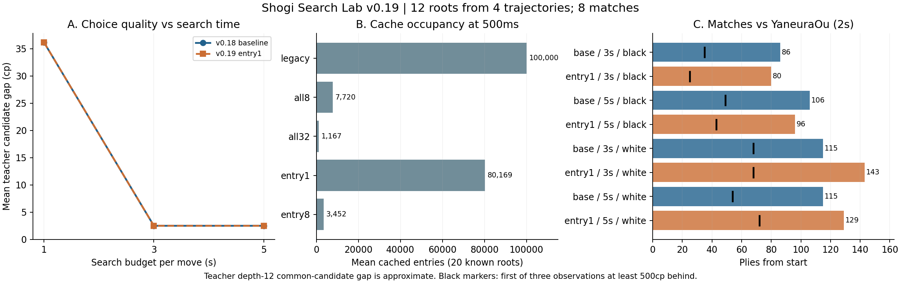

# v0.19：保存対象の見直しと、探索統計の軽量化

**探索結果を変えない統計処理の軽量化を標準へ反映した。同一ノード比較で新ビルドの時間中央値の合計は旧版より4.0%短かった。重い読みだけの保存と入口だけの保存も実装したが、新しい12局面では入口保存版と旧版の着手評価は全36組で同等。棋力向上を確認したとは扱わず、保存の新方式は任意の実験設定として残す。**

2026-09-22。起点はv0.18コミット `00e7c5de859fcbf8af46446ec96e8eef3af8d4d7`。実装は `work/v0.19-cost-aware-cache`、ソース保存コミット `6260f708db6a0e7ce40d059cbded47432b82945b`。mainへのマージは行っていない。

## 考察から実装へ

前回は読みの保存領域100,000件が早期に埋まり、照合と保存の負担が残った。今回の開発20局面では、従来設定の保存操作2,008,346回のうち1,572,064回（78.3%）が1ノードで終わる読みだった。これは保存時の操作数で、固有節点の割合ではない。

そこで、次の3点を実装した。

1. **保存の最低費用**：`--qcache-min-nodes 8` / `32`。完了した読みの実訪問ノード数で保存を選ぶ。候補手の打ち切り条件には使わない。
2. **入口だけの保存**：`--qcache-scope entry`。静止探索内部の経路登録・照合を省く。履歴を含む入口IDでのみ値を再利用する。
3. **統計処理の軽量化**：手数ごとの戻り回数を配列で集計し、最後に従来のJSONへ変換する。毎ノードの文字列生成とマップ検索を減らし、出力の意味と値を保つ。

NNUEと根の方策モデルは固定。深さ・上位k手の固定制限は加えず、上界・下界・詰み距離・千日手の扱いを維持した。保存の既定設定 `all`・閾値1も互換性のため残した。qcache自体は標準では有効にしない。

## 開発比較：容量削減と棋力を分ける

v0.18で使用済みの20局面・各500ms・6方式。詰み評価の1局面を除く19局面で教師候補差を比較した。これは開発集合であり新規評価ではない。

| 方式 | 平均保存件数 | 平均処理ノード | 平均候補差cp |
|---|---:|---:|---:|
| 保存なし・新ビルド | 0 | 217,121 | 39.42 |
| 従来の全節点保存 | 100,000 | 175,074 | 21.47 |
| 8ノード以上を保存 | 7,720 | 177,503 | 38.05 |
| 32ノード以上を保存 | 1,167 | 187,987 | 21.47 |
| 入口だけ保存 | 80,169 | 203,335 | 21.47 |
| 入口・8ノード以上 | 3,452 | 209,008 | 21.47 |

閾値によって保存件数は大幅に減ったが、全節点方式では内部の経路登録費用が残った。入口方式はその登録を省く。処理ノード数はキャッシュで省けた読みを数えないため、その大小だけで速さ・強さを比べない。

事前規則は平均候補差、同点なら完了反復数、さらに同点なら規定順。入口だけ保存するentry1を追試へ選んだ。ただし保存なしとの差は、既知の根 `prior-1-56` の1局面に由来する。入口版は2反復の `1b2b`、保存なしは3反復の `1b2a` で、教師差341cpだった。ただし教師評価はそれぞれ+6,104cpと+5,763cpで、どちらも大幅なプラスの局面である。この差を対局の勝敗改善とみなさない。**この開発時の優位は、浅い段階の手を維持した結果であり、より深く読めた証拠ではない。**

## 新しい局面での追試

別seedの4教師進行から12局面を採り、旧版標準と入口保存版を1/3/5秒で比較した。全72探索が初回反復を完了。各条件1回。全方式・予算の選択手と教師自身の手を共通集合にし、固定教師の深さ12で採点した。値は候補集合内の差であり、全合法手に対する真の損失ではない。

| 自作の時間 | v0.18標準 | v0.19入口保存 | 対応比較 |
|---|---:|---:|---|
| 1秒 | 36.17cp | 36.17cp | 0改善・12同等・0悪化 |
| 3秒 | 2.50cp | 2.50cp | 0改善・12同等・0悪化 |
| 5秒 | 2.50cp | 2.50cp | 0改善・12同等・0悪化 |

1秒から3秒では両方式とも平均候補差が改善し、3秒から5秒は同等だった。新しい局面で開発時の優位は再現しなかった。入口保存も3秒以降は12局面すべてで100,000件へ達しており、入口だけに絞れば容量問題が解決するわけではない。

4進行内の局面は相関し、過去の学習との完全な非重複は保証しない。Elo・有意な棋力差・安定した一般化区間は算出しない。

## 対局

初期局面から戦型指定・定跡なしで8局。先後を交換し、自作3秒/5秒、固定やねうら王NNUE 6.03 WASMは2秒。最新ネイティブ版との比較ではない。2方式は同じ条件・同じCPUコアで順に指し、組ごとに順序を逆転させた。

| 方式 | 自作の時間 | 先後 | 終局手数 | 結果 | 500cp不利の継続開始 |
|---|---:|---|---:|---|---:|
| v0.18標準 | 3秒 | 先手 | 86 | 負け | 35 |
| 入口保存 | 3秒 | 先手 | 80 | 負け | 25 |
| v0.18標準 | 5秒 | 先手 | 106 | 負け | 49 |
| 入口保存 | 5秒 | 先手 | 96 | 負け | 43 |
| v0.18標準 | 3秒 | 後手 | 115 | 負け | 68 |
| 入口保存 | 3秒 | 後手 | 143 | 負け | 68 |
| v0.18標準 | 5秒 | 後手 | 115 | 負け | 54 |
| 入口保存 | 5秒 | 後手 | 129 | 負け | 72 |

結果は0勝・8敗・0引分・0未決着。各方式・時間は先後1局ずつであり、勝率や持ち時間の優劣を一般化しない。500cp欄は相手の確定cp評価で500以上が3回連続観測された最初の時点で、敗着の確定ではない。手数が伸びた場合も、不利になった後に長引いたかを区別する。

- 3秒・先手：旧版86手→入口保存80手。不利継続開始は35→25手。
- 3秒・後手：旧版115手→入口保存143手。不利継続開始は68→68手。
- 5秒・先手：旧版106手→入口保存96手。不利継続開始は49→43手。
- 5秒・後手：旧版115手→入口保存129手。不利継続開始は54→72手。

## 検証と残った問題

- セルフテスト **7,058チェック通過**。履歴依存の千日手・連続王手、詰み、容量1、途中停止、保存閾値、合法PVを含む。
- 保存無効の8局面×3回・20万ノードで、旧版と値・PV・ノード数・停止理由・全統計が一致。追加の8局面×6方式では、旧設定の互換性と完了した最初の静止探索の値を比較した。上位の全反復の値が不変という主張ではない。
- 時間中央値の合計比は0.9597、新ビルドが約4.0%短い。ただし8局面中2局面は遅く、単一環境・各3回の測定。これはビルド全体の差で、変更した命令ごとの因果分離ではない。
- 独立ルール実装で8局・870着手、661探索出力、PV延べ6806手、教師候補48本、生成進行256手を検査。KIFの読み戻しと終局状態も一致。
- 既知の難しい終盤6局面・1秒では、保存なし・新ビルド 0/6完了、従来の全節点保存 0/6完了、8ノード以上を保存 0/6完了、32ノード以上を保存 0/6完了、入口だけ保存 0/6完了、入口・8ノード以上 1/6完了。大半の初回比較未完了は残った。
- 実行環境の切断後、white-5000-entry1の46手、black-5000-baseの64手、white-3000-entry1の109手から再開した。旧プロセスの停止を確認し、毎手リセットという条件を維持。再開位置・時刻を保存した。

**採用するのは、互換性を確認した統計処理の軽量化。入口・最低費用による保存は実験機能として残す。** 新しい保存方式だけで強くなったとは結論しない。次に優先すべき課題は、反復を深めた際に良い手を失う局面での評価・反論の追跡と、初回比較を完了できない終盤の処理である。

[観戦ファイル](v0.19-review.html)に8局の盤面と読み筋を収録した。HTMLのJavaScript構文・収録データは検査済みだが、ブラウザーでの画面操作確認は未実施。[設計](RESEARCH-v0.19.md)、[再現手順](REPRODUCE-v0.19.md)、`results/v0.19/` にプロトコル、固定ハッシュ、原データ、CSV、棋譜、監査を保存した。
