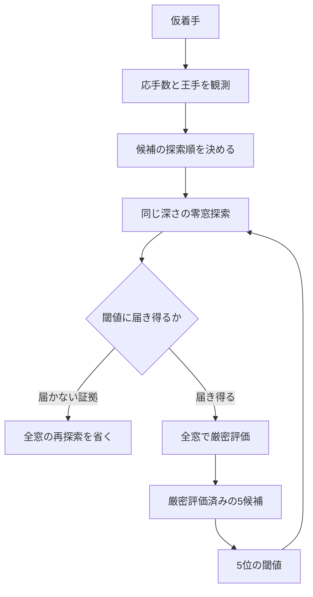

# 将棋探索と制約伝搬：文献レビュー・実装実験・研究方針

2026-09-21 / Shogi Search Lab v0.4

## 今回の結論

ナースロスタリング研究の「仮固定→影響の観測→境界の更新→分岐判断」という研究方法を、将棋の探索に応用できる。ただし、将棋では相手の選択をこちらで固定できない。**仮着手による応手の制限は探索順序の情報に使い、枝刈りは評価境界の証明に基づける**、という分離を当面の基本方針とする。

実装したのは、上位5候補の5位を閾値にする同一深さの零窓探索と、仮着手後の応手数を調べる一手先の試行である。前者を標準設定に採用し、後者は実験設定として残した。22条件・4方式・各3回の264実行で上位5手と評価値が一致。零窓による選別は、従来方式に対して訪問数を63.3%、局面別時間中央値の合計を64.0%減らした。応手数による並べ替えを追加すると訪問数は17.5%増え、合計時間は0.8%増えた。わずかな時間差に統計的有意性は主張しない。

これは「指定した深さ・現在の駒得評価に対する上位5手」を効率よく求める結果であり、真の最善手や棋力向上の証明ではない。一般的なCPソルバーを将棋へ移植したわけでもない。今回の枝刈りはSCOUT系の既存原理の応用で、新しい探索理論の発明とは位置付けない。

## 1. 文献から得た設計上の判断

一次資料を優先し、以下の7論文・著者公開稿と固定版の実装を確認した。Refalo論文は出版社の要旨・書誌情報までで、購読が必要な本文を読めたとは扱っていない。ほかは本文中の関連するアルゴリズム、前提、実験条件を確認した。Web閲覧日は上記実行日。論文の図のスクリーンショット取得は利用できず、本文テキストと数式・擬似コードの抽出結果を使った。

| 一次資料 | 確認した内容 | 今回への反映・適用限界 |
|---|---|---|
| Judea Pearl (1980), [SCOUT](https://cdn.aaai.org/AAAI/1980/AAAI80-041.pdf) | 値そのものを求める操作と、基準値を超えるかを判定する操作を分離する | 全候補に厳密値を求めず、5位を超え得る候補だけ再探索する。同一深さを維持する |
| Tsuruoka, Yokoyama, Chikayama (2002), [Game-Tree Search Algorithm Based on Realization Probability](https://www.nactem.ac.uk/tsuruoka/papers/icga02.pdf) | 棋譜から得た手のカテゴリの確率で探索資源を配分し、有望な手は再探索する。将棋での実験 | 取り返し・王手・成り・逃げなどを今後の順序付けと延長の特徴候補にする。確率の低さを不可能性とはみなさない |
| Winands, Björnsson, [Enhanced Realization Probability Search](https://dke.maastrichtuniversity.nl/m.winands/documents/ERPS.pdf) | 早い順位の手の削減を抑え、段階的に再探索して戦術上の見落としと余分な再探索を扱う | 深さを削る実験には見落とし検査が必要。この実験対象はLines of Actionで、将棋の効果量として転用しない |
| Philippe Refalo (2004), [Impact-Based Search Strategies for Constraint Programming](https://link.springer.com/chapter/10.1007/978-3-540-30201-8_41) | 要旨では、探索中に観測する領域縮小を変数・値選択に利用する | 応手数などの影響を観測し、費用と一緒に評価する着想。今回の応手数はRefaloのimpactの忠実な実装ではない |
| Kishimoto, Müller (2004), [A General Solution to the Graph History Interaction Problem](https://cdn.aaai.org/AAAI/2004/AAAI04-102.pdf) | 盤面が同じでも到達履歴により値が異なり、無条件のキャッシュ共有が誤答を生む | 現状は同じ手順の部分木だけ再利用する。盤面ハッシュだけの合流は、千日手・連続王手を考慮する設計後に行う |
| Franz et al. (2022), [Completeness and Diversity in Depth-First Proof-Number Search](https://www.ijcai.org/proceedings/2022/0658.pdf) | AND/OR探索、循環を持つグラフでのDFPNの問題、TCAを組み合わせた完全性 | 詰みの証明探索の候補。論文の勝敗・循環の前提を、日本の将棋ルールへ検討なしに同一視しない |
| Silver et al. (2017), [Mastering Chess and Shogi by Self-Play](https://arxiv.org/html/1712.01815v1) | 方策・価値ネットワークでMCTSの探索配分を導く | 有望度に応じて計算を配る別系統の参考。現段階では学習基盤を伴う全面移行より、説明可能なC++探索の整備を優先する |
| [YaneuraOu.wasmの固定ソース](https://github.com/arashigaoka/YaneuraOu.wasm/tree/b2defb6d255ea44b3fead30e13f28b96e0ab0cc7/source) | ローカルに含む検索コードのMultiPV、aspiration、静止探索、null move、ProbCut、ponderの処理 | 各技法の役割と組合せを研究。駒得評価の小さな研究エンジンに、枝刈りの定数をそのまま移植しない |

ERPSの参照PDFはページヘッダーに2007年7月21日とある著者公開稿。ここでは未確認の最終掲載年を付与しない。RPSの著者名・年は原論文で確認し、二次資料の書誌上の不一致を引き継がない。やねうら王については[公式リポジトリ](https://github.com/yaneurao/YaneuraOu)も確認したが、実装比較は上記固定コミットに限定し、最新版の挙動とは主張しない。

### 似ている技法でも、保証は異なる

今回採用した零窓探索は、**探索する深さを削らず、必要な答えを大小判定へ変える**。閾値判定で有望と分かった手は全窓で厳密評価する。対してRPS・LMR・futility・ProbCutなどは、読む深さや枝そのものを選択的に減らす。静的な駒得や浅い結果から深い値を推定するため、同一深さの全幅探索との一致は一般には保証できない。この区別を実験設定とログに残す。

RPS原論文の実装は静止探索や詰み探索も併用している。静止探索のない現エンジンに手の確率や削減量だけを移植しても、その論文の条件を再現したことにはならない。ERPSが扱う地平線効果も踏まえ、**静止探索と戦術検証を先に整備し、その後に選択的な深さ削減を試す**方針とした。[RPS原論文](https://www.nactem.ac.uk/tsuruoka/papers/icga02.pdf)、[ERPS著者稿](https://dke.maastrichtuniversity.nl/m.winands/documents/ERPS.pdf)

## 2. ナースロスタリングの構造解析との対応

ユーザーの研究で重視してきた「仮固定に起因する伝搬を追う」「影響件数だけで良し悪しを決めない」「境界・矛盾・探索費用へ接続する」という観測設計を移す。今回はナースロスタリング側のモデルやソルバーを変更しておらず、その研究での数値結果を再実験したものではない。

| 構造解析の観点 | 将棋での対応 | 扱い |
|---|---|---|
| 変数を仮に固定する | 一手を仮着手して元へ戻す | 実装済み。盤面・履歴とも復元する |
| 制約により選択肢が狭まる | 王手への応手、ピンなどを含む合法手集合 | 既存の合法手生成器に委任。今回は件数と王手状態を観測 |
| 固定の影響を測る | 応手数、王手、仮着手後の駒得 | 探索順序にのみ使用する |
| 矛盾による枝の除去 | 非合法手・詰み・確定した終局 | ルールに従って判定する |
| 目的値境界の更新 | 子の上限・下限を符号反転して親へ戻す | 指定深さの評価に対する健全な境界として扱う |
| 現在解より良くならない枝の除去 | 5位の閾値に届かない証明 | 今回の主な高速化 |
| 発火元・伝搬先・連鎖の記録 | event_id、parent_id、cause_id、5候補の証拠イベント | 実装済み。ただし合法手生成器の内部制約発火ログではない |
| 隣接部分間で繰り返し整合させる | 同じ深さの子の境界から親を更新する | 木では帰りがけの更新。将来グラフ共有する場合は履歴と再伝搬が課題 |

### 最も大きな違い：存在する解と、相手の全応手への対応

勤務表では、通常は制約を満たす割当を一つ見つければよい。対して将棋で「勝てる手順」を示すには、自分のある着手に対し、**相手がどの応手を選んでも**対応できる必要がある。おおまかには、前者の存在量化に対し、後者は `∃自分の手 ∀相手の手 ∃自分の手 …` となる。

したがって、王手で相手の応手が1手になっても、その1手がこちらの攻めを破るなら有利ではない。応手数が多くても、どの応手にも勝てる手は有力である。また手番の違う二つの局面で数えた合法手集合は、同じ変数の領域ではない。「30手から5手になったのでCPの領域を6分の1に削減した」という解釈も避ける。

将来「詰めろへの受け以外を捨てる」を試す場合も、脅威の存在だけでは足りない。先に詰ます反撃、王手による猶予、脅威そのものを消す応手を含めて、除外対象が本当に負ける証拠が必要になる。これはAND/ORの証明探索へ接続しやすい研究課題である。

## 3. 実装した評価境界の伝搬

局面 `s`、残り深さ `d`、これまでの手順を含む履歴 `h` に対し、手番側の値を `V_d(s,h)` とする。終局ではルールの値、深さ0では現在の駒得評価を返す。それ以外はnegamaxで

\[
V_d(s,h)=\max_m\{-V_{d-1}(s_m,h+m)\}
\]

とする。子の値が区間 `[L_m,U_m]` に入るなら、その着手の値は `[-U_m,-L_m]` に入る。すべての合法手に境界があれば、親について

\[
L(s)=\max_m(-U_m),\qquad U(s)=\max_m(-L_m)
\]

となる。未探索の子は原則として無情報の区間のままなので、分かった子だけで親の上限を勝手に小さくしてはいけない。実装では汎用の区間固定点ソルバーを作る代わりに、fail-soft αβ探索の `exact/lower/upper` と探索窓で必要な境界だけを計算する。

### 5位を基準にする選別

1. 同じ深さの厳密値を持つ候補をまず最大5手そろえる。
2. 5位の評価を `τ`、新しい手を `m` とする。
3. 同点ならUSI文字列順で順位を決めるため、同点で5位に勝つ `m` なら `t=τ`、負ける `m` なら `t=τ+1` とする。整数評価であることを使う。
4. 子を窓 `[-t,1-t]`、残り深さ `d-1` で読む。
5. 根側の値の上限が `t` 未満と確定すれば、5位へ入らない。厳密な値を求める再探索を省く。
6. 入れ替わる可能性があれば全窓で再探索し、厳密値で5候補を更新する。

選別された手も全く読まないわけではない。零窓の境界判定を行い、その中のαβ打切りで読む枝を減らす。5位の閾値は一つの反復内では悪化しないので、その時点で除外できた手は、より高い閾値に対しても除外できる。

深さを増やすと値の対象自体が変わる。前の深さで選外だった合法手も次の反復では必ず再検討する。**「保持は5手」「次回の探索対象は全合法手」**を維持した。



最初の5手をそろえる段階では直接全窓で読む。応手観測は実験設定だけで使用する。図の後半の境界判定は、観測機能がオフでも動く。

### 一手先の構造観測

`--root-policy probe` または `full-probe` で有効化する。深さ2以降の根で、合法手を一度ずつ仮着手し、相手の合法手数・王手状態・駒得を観測する。同じ分析要求の反復間では観測を共有する。前回PVを優先した上で王手、応手数の少なさを順序付けに使う。駒得はログの観測値で、追加の安全な境界とはみなさない。

仮着手も通常探索と同じ時間・訪問数予算を消費する。`nodes`には試行ノードを含み、`probe_nodes`で区別する。合法手を数える途中ではなく試行の入口で予算を検査するため、1試行内の処理時間分だけ時間制限を超過することはある。

これは探索中の一手先の試行であり、相手の思考時間中に自動で動くUSIのponderではない。現在も`go`で着手せず追加探索でき、保持した上位5手が指されたらその部分木を引き継ぐ。背景で入力を待ちながら動くワーカーは今回追加していない。

## 4. 実験条件と結果

### 比較方法

`experiments/v0.4-protocol.json`に測定前の条件を保存した。既存8条件、以前の合法手照合用ランダム局面から選んだ7条件、疎な盤面・戦術の4条件、深さ4の2条件、および既存局面の重複1条件で合計22条件。深さ3が20条件、深さ4が2条件である。独立した22対局ではない。

追加局面の選択は既存の記録の添字12,21,30,39,48,57,66,75で固定した。添字12は既存のpin-and-dropと同一だったため、後でgroupを`replicate_fixture`へ訂正した。8つの未知局面とは数えず、ランダムな保留サンプルは7つとする。測定値を削除・変更していない。これらも過去に合法手の検証には使用されており、完全に未見の棋譜ではない。今回の並べ替え方針は結果を見て調整していない。

各方式3回、順番を回転させ、別プロセス・空の木から逐次実行。各方式に事前の別プロセスでのウォームアップを1回行った。保持容量50,000ノード、訪問上限5,000,000、時間制限なし、反復深化あり。計測中に他のテスト・ビルドを並行しなかった。時間はエンジン内の分析部分で、プロセス起動や盤面初期化を含まない。ログは速度計測中オフ。比較基準`full`は同じ現行コードで全根候補に全窓探索を行う設定であり、過去版の計測値との混合ではない。

### 主結果

時間は**条件ごとの3回の中央値を合計**した値。訪問数も同じ単位で合計している。仮着手の計算費用を含む。

| 方式 | 訪問数 | 時間 ms | 全窓の根候補探索 | 零窓で除外 | 有望判定後の再探索 |
|---|---:|---:|---:|---:|---:|
| `full`：全根候補を厳密評価 | 154,118 | 1,054.703 | 2,409 | 0 | 0 |
| `screen`：5位による境界選別 | 56,617 | 379.423 | 421 | 1,988 | 87 |
| `full-probe`：全窓＋応手数順序 | 154,914 | 1,119.785 | 2,409 | 0 | 0 |
| `probe`：境界選別＋応手数順序 | 66,503 | 382.540 | 483 | 1,926 | 149 |

`screen`は22条件中21条件で時間中央値が短かった。訪問数63.3%減、時間合計64.0%減、合計値の比で約2.78倍。ただし小さな固定集合・短時間・共有実行環境の測定であり、すべての局面・深さでその倍率になる意味ではない。負けた条件は駒の少ない同点局面の深さ4だった。

応手観測は計796試行。`full-probe`の訪問数増796は、その試行数と一致する。根候補を全窓で独立に読む設定では、根の順序変更だけで候補内部の訪問数を削減するとは限らない。`probe`は`screen`より再探索が87→149に増え、追加の796試行だけでは説明できない計9,886訪問の増加があった。**観測そのもののコストに加え、順序変更が5位の閾値の上がり方と再探索数へ及ぼす効果も測る必要がある。**

| 条件群 | 条件数 | full ms | screen ms | probe ms |
|---|---:|---:|---:|---:|
| 既存 | 8 | 838.030 | 280.413 | 279.417 |
| 保留ランダムサンプル | 7 | 169.105 | 71.747 | 76.065 |
| 戦術・疎な盤面 | 4 | 8.603 | 7.006 | 7.566 |
| 深さ4 | 2 | 17.499 | 11.888 | 12.013 |
| 既存盤面の重複測定 | 1 | 21.466 | 8.369 | 7.479 |

根の応手数に有用性が全くないとは結論しない。今回の単純な並べ替えを全局面で常用する根拠が得られなかった、という結論にとどめる。盤面別結果・3回すべての実行記録は`summary.json`と`timings.json`に残した。

### 「影響が少ない／浅い評価が低いので捨てる」の監査

次の三つは実際のエンジンでは有効化していない。全候補の同一深さの厳密評価を取得した後、もしこの基準で捨てていたら何が失われたかをオフラインで調べた。

| 仮の除外基準 | 最良の評価値を失う条件 | 上位5手のどれかを失う条件 |
|---|---:|---:|
| 仮着手後の応手が少ない5手だけ残す | 5 / 22 | 16 / 22 |
| 深さ1で上位5手だけ残す | 3 / 22 | 17 / 22 |
| 深さ1の評価が、その深さの5位より200を超えて低い手を捨てる | 0 / 22 | 1 / 22 |

同点で別の手を残すだけでも上位5手の集合は変わるため、「上位5手を失う」と「最良の評価値を失う」を分けた。`fewest_replies_keep5`の5条件には重複fixtureが1条件含まれる。200という余裕はこの監査で事前に固定した試験値で、最適化された安全幅ではない。最良値の見落としが0件でも普遍的安全性は示せず、要求された5候補の維持にも1条件で反する。

具体例として`gokigen-36`では、応手数が少ない5手だけを残すと、深さ3で最良の`R*4a`を落とし、残した集合の最高値は2,900低かった。これも現在の駒得評価に対する反例で、実戦的な2,900点の優劣が保証された意味ではない。個別の除外対象は`audit.json`に記録した。

## 5. 正しさと観測可能性

| 検査 | 結果 |
|---|---|
| 従来のルール・探索テスト | 115項目合格 |
| 継続モード | 1,274項目合格。4方式×5局面×深さ1〜3を独立した全幅minimaxと照合 |
| 固定集合の方式間比較 | 264実行すべての上位5候補・評価値が一致 |
| 境界判定の証拠 | 4,150判定を全窓の根候補値と照合。うち3,914の除外が境界と順位条件を満たす |
| 読み筋 | 選別2方式の計216本を合法に再生し、末端評価・詰み距離を照合 |
| 5候補の継続 | 1〜5位すべてで同じ候補ノードを根へ移し、新規全窓探索と同じ上位5候補になる |
| 追加の試行の予算 | 試行途中の上限到達でも盤面と履歴を復元し、最後の完了順位を維持 |
| メモリ・終局 | 既存の容量上限、千日手、連続王手、詰み距離の回帰検査を維持 |
| 記録の完全性 | 完全な小規模トレース1,708イベント。打切り上限に達した場合は`trace_truncated`を明示 |
| ASan・UBSan | 従来115項目・継続モード1,274項目合格。リーク検出は実行環境のptrace制約により無効 |

境界監査の比較基準は全窓αβであり、それだけで完全に独立した正しさの証明ではない。別途、少数局面の全幅minimaxと、合法手生成器の以前の独立照合結果を併用する。

速度測定とサニタイザー検査の後に加えた変更は、トレースの5候補の証拠に元イベントIDを付ける記録処理である。探索・評価・順序付けの条件は変えていない。この最終記録形式について4,150判定の境界監査を再実行し、証拠リンクまで照合した。サニタイザーの実行記録は追加前の記録形式に対するものとして残している。

`traces/recursive-example.jsonl`には、局面・仮着手から再帰探索、子の返値、符号反転による親の更新、打切りまでを残す。`top5_certificate.witnesses`は5候補の手・厳密値・元の`root_exact`イベントへの`cause_id`を持つ。`cause_id`は先行イベントを参照し、監査スクリプトで整合性を確認する。

ログ中の`search_result.bound`が`lower`なら下限、`upper`なら上限である。候補側へ戻すと符号と境界方向が反転する。確定値でないスコアをそのまま候補順位へ入れない。キャッシュの値は同じ履歴・残り深さの保存値であることを`origin`に記す。過去の分析要求をまたぐ証明イベント列を永続的に連結しているわけではない。

`--trace-root-only`では内部探索を記録せず、その部分の`cause_id`は0となる。これは記録省略を意味し、完全な内部証明を再構成できるログとは扱わない。根の5候補の証拠リンクと、全窓基準との事後照合は可能。`--trace`の出力ファイルは分析要求ごとに上書きするため、連続要求を個別に残す場合はファイル名を分ける。

観測は合法手生成器の内部まで追っていない。「どの利き・ピン・二歩制約によりどの指し手が消えたか」の因果関係は、今回の応手数から復元できない。この点がナースロスタリングの制約単位の伝搬ログとの大きな差であり、次の構造解析で埋める対象になる。

実例は`certificate-example.json`に抜粋した。深さ3で5候補の厳密値がすべて550となった時、`5e5g`は同点で5位の`5e5f`に負けるため必要値は551。子から返った下限−550を符号反転すると、その候補の上限は550となり、全窓の再探索を省ける。イベント1237は、子の境界イベント1236と5候補の厳密評価イベントを参照する。抜粋の省略部分は完全なJSONLを参照する。

## 6. 今後の研究方針

今後は、次の順序で一つずつ比較実験を行う。項目は研究計画であり、実装済みと混同しない。

| 順序 | 実装・研究 | 主な仮説と評価 | 採用の判断 |
|---|---|---|---|
| 1 | 静止探索と戦術集合 | 駒の取り合いの途中で評価を止める誤りを減らす。王手中は全合法な回避手を読む | 取り返し・駒捨て・成り・打ち歩詰め・連続王手の固定問題で確認。従来の固定深さと値が変わること自体は誤りとしない |
| 2 | 低費用の高速化 | 駒得の差分更新、手のソート費用、ノード確保を計測し、費用の大きな箇所を減らす。内部PVSも個別比較 | 同一深さ・同一評価での一致を保ち、単位ノード時間と総時間の両方が改善するかを見る |
| 3 | 制約・脅威の原因を追う観測 | 王手回避、ピン、唯一手、取り返しなどがどの応手を制限したかをイベント化する | 応手数だけの方式を上回るか。特徴量の取得費用を含め、保留局面で境界判定当たりの節約を測る |
| 4 | 上位5候補への先読み配分 | 相手の思考時間中、5候補を公平な最低予算つきで読む。境界が曖昧な枝へ余剰予算を配る | 先読み時間も総予算に含め、候補一致・外れの両方で着手後の待ち時間と最終品質を測る |
| 5 | 選択的な深さ削減と詰み証明 | 非王手・遅い静かな手への控えめなLMR、再探索条件、RPS型特徴。別系統で詰みのAND/OR証明を検討 | 見落とし率と同時間での戦術成績を報告。差分が出た全局面を保存。証明系では履歴・循環・証明木の再生を必須にする |

### 次に立てたい研究仮説

**H1：影響の大きさより「境界を確定する費用」を予測する方がよい。**
応手数、王手、唯一手、取り返し、PVとの差などから、零窓判定の費用と成功率を予測する。まずは説明可能な小さな回帰・決定木や集計表で十分。教師信号は「強い手か」だけでなく、判定による削減訪問数、再探索の追加訪問数、観測時間とする。順位を変えるだけなら、予測が外れても同一深さの正しさは守れる。

**H2：制約連鎖が短くても、親の5位閾値を押し上げる手は計算価値が高い。**
根の全候補を少数ずつ調べる方式と、有望候補を先に厳密化する方式を比較する。影響件数ではなく「親・祖先の境界にどれだけ効いたか」を測る。NRPの目的値境界に着目する構造解析と対応するが、交互手番の符号反転を必ず含める。

**H3：観測は常時でなく、判断が曖昧な局面でだけ買う方がよい。**
5位付近の候補、王手や取り返しが絡む局面、零窓の再探索が多い局面に観測費用を配る。今回の結果からこの方式が速いと分かったわけではない。後続実験で、常時オフ・常時オン・条件付きの3方式を固定した保留棋譜で比べる。

先読み配分の将来の目的関数は、候補が実際に指される確率 `p(m)` と、その候補を今読むことで後の待ち時間が減る期待量の積を、先読み費用で割った量が候補となる。ただし確率の小さい候補を永続的に0予算にせず、上位5手への最低予算を設ける。これは今後検証する提案で、学習済みの着手確率や背景実行機能はまだない。

### 評価設計

- **正しさの集合**：既存ルール検証、全幅minimaxと同じ深さの比較、同点、履歴、予算中断、キャッシュ上限。
- **構造解析の集合**：イベント連鎖、境界更新量、分岐数、観測費用、再探索費用、除外に至った証拠。
- **戦術の集合**：固定された正解・十分深い参照・詰みの証拠を持つ別の問題群。訓練・調整用とは棋譜単位で分離する。
- **速度の集合**：同じ深さ・同じ評価の総時間と訪問数、さらに同じ時間で完了した深さ。ノード毎秒だけで評価しない。
- **棋力の集合**：後段で、開始局面と先後を揃えた対局、引分を含む信頼区間。今回の実験だけからEloは算出しない。

静止探索が入るまではLMRやfutilityを一括投入しない。置換表の盤面共有はGHIへの対策を設計してから行う。NNUE等の学習評価は、差分評価・探索・測定系が安定した段階で別の効果として比較する。

## 7. 再現と成果物

```bash
make -j2
make test
# 時間測定は他の重い処理と並行しない
python3 scripts/benchmark_propagation.py
python3 scripts/audit_propagation.py
bash scripts/sanitize.sh
```

```bash
# 標準：上位5手の同一深さの境界選別
./build/shogi-lab --session --root-policy screen
# 一手先の応手観測を加える実験
./build/shogi-lab --session --root-policy probe
# 詳細な因果ログを記録する。起動後 go depth 3 などを入力
./build/shogi-lab --session --root-policy probe --trace trace.jsonl --trace-limit 200000
```

`go depth 3`、`play MOVE`、`advance MOVE`などの既存操作は継続して利用できる。上位5候補の保持・着手後の根の移動・自動追加探索は維持した。プロセスを終了すると実行中の木は消える。

- 実装：`src/session.cpp`、`session.hpp`、`lab.hpp`、`main.cpp`。
- 機能検証：`src/session_tests.cpp`。
- 条件：`experiments/v0.4-protocol.json`。
- 生データ・要約・監査・因果ログ：`results/v0.4/`。
- 以前の実装：`checkpoints/v0.3/`。合法手生成・駒得の値・単発minimaxは比較基準として維持した。

入玉宣言、静止探索、学習評価、非同期ponder、ディスクへの木の保存は未実装。研究コードはGPL-3.0-or-later。ライセンスと第三者コードの出所は`LICENSE`、`THIRD_PARTY.md`を参照。
